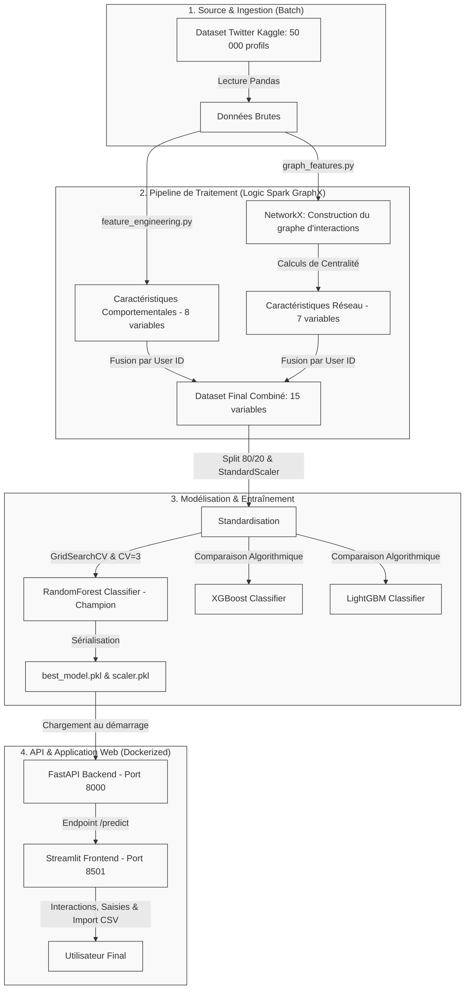

# RAPPORT DE PROJET TUTORÉ : INGÉNIERIE IA & BIG DATA

---

## PAGE DE GARDE

**INSTITUTION :** Université des Sciences et Technologies  
**FILIÈRE :** Ingénierie de l'Intelligence Artificielle & Big Data  
**ANNÉE ACADÉMIQUE :** 2025-2026  

 

**THÈME :**  
## SUJET N°9 : SYSTÈME DE DÉTECTION DE BOTS SUR RÉSEAUX SOCIAUX — ARCHITECTURE HYBRIDE EN APPRENTISSAGE SUPERVISÉ ET THÉORIE DES GRAPHES

 

**Présenté par :**  
**MINEKPOR Apélété Samuel**  
*(Travail réalisé individuellement en monôme — Dérogation validée par le corps enseignant)*  

**Sous la direction de :**  
**Dr. TCHAYE-KONDI Jude**  

**Date de rendu :** 12 Juin 2026  

---

## REMERCIEMENTS

Je tiens à exprimer ma profonde gratitude à mon professeur et directeur de projet, **Dr. Jude Tchaye-Kondi**, pour la qualité de son enseignement tout au long du cours "Projets AI & Big Data". Sa rigueur académique et ses conseils concernant l'analyse distribuée et l'analyse relationnelle (Graph ML) ont été déterminants dans la conception de ce système.

Mes remerciements s'étendent au corps professoral de la filière Ingénierie de l'IA et Big Data pour m'avoir accordé la dérogation nécessaire à la réalisation de ce projet complexe en monôme, me permettant ainsi de relever un défi complet touchant à l'ensemble du cycle de vie du logiciel (du pipeline de données au déploiement).

---

## SOMMAIRE DÉTAILLÉ

1.  **[1. INTRODUCTION](#1-introduction)**
    *   1.1 Contexte : La prolifération des comptes automatisés sur Twitter (X)
    *   1.2 Problématique métier : Limites de l'analyse individuelle et intérêt des graphes
    *   1.3 Objectifs et livrables du projet
2.  **[2. DESCRIPTION ET COMPRÉHENSION DES DONNÉES](#2-description)**
    *   2.1 Source des données et caractéristiques du jeu de données
    *   2.2 Analyse Exploratoire (EDA) et corrélations majeures
    *   2.3 Gestion des anomalies, des doublons et des valeurs manquantes
    *   2.4 Ingénierie des caractéristiques : Description détaillée des 15 variables
3.  **[3. ARCHITECTURE DU SYSTÈME](#3-architecture)**
    *   3.1 Schéma d'architecture globale (Pipeline de bout en bout)
    *   3.2 Modélisation du graphe d'interactions et logique distributive Spark GraphX
    *   3.3 Technologies et outils utilisés
4.  **[4. MODÉLISATION](#4-modelisation)**
    *   4.1 Choix et justification des modèles d'apprentissage (RF, XGBoost, LightGBM)
    *   4.2 Méthodologie d'optimisation et protocole de validation (GridSearchCV, CV=3)
    *   4.3 Entraînement et sérialisation du modèle champion
5.  **[5. ÉVALUATION ET COMPARAISON DES MODÈLES](#5-evaluation)**
    *   5.1 Métriques d'évaluation utilisées
    *   5.2 Tableau comparatif des performances
    *   5.3 Analyse de l'importance des variables et des courbes ROC
6.  **[6. DÉPLOIEMENT DU SYSTÈME](#6-deploiement)**
    *   6.1 Backend API : Inférence temps réel avec FastAPI
    *   6.2 Frontend Application : Dashboard interactif avec Streamlit
    *   6.3 Infrastructure DevOps : Conteneurisation multi-services avec Docker-Compose
7.  **[7. DÉMONSTRATION DU SYSTÈME ET CAS D'USAGE](#7-demonstration)**
    *   7.1 Scénarios et cas d'usage réels
    *   7.2 Système d'explicabilité du verdict en 8 points clés
8.  **[8. LIMITES DU SYSTÈME ET AMÉLIORATIONS FUTURES](#8-limites)**
    *   8.1 Analyse critique de la perfection des résultats (Biais du dataset)
    *   8.2 Distorsion induite par la standardisation globale (Scaler)
    *   8.3 Perspectives d'évolution : Kafka Streaming et Graph Neural Networks (GNN)
9.  **[9. RÉPARTITION DU TRAVAIL](#9-repartition)**
    *   9.1 Justification du monôme
    *   9.2 Rôles et responsabilités détaillées
10. **[SOURCES ET RÉFÉRENCES](#sources)**

---

## 1. INTRODUCTION

### 1.1 Contexte : La prolifération des comptes automatisés sur Twitter (X)
À l'ère du Web 2.0, les réseaux sociaux comme Twitter (désormais X) constituent des canaux majeurs d'information et de débat public. Cependant, l'intégrité de ces plateformes est fortement menacée par la prolifération de comptes automatisés, communément appelés **bots**. Ces automates sont capables de simuler des comportements humains à grande échelle pour diffuser des infox (fake news), manipuler des scrutins politiques, gonfler artificiellement la popularité de certaines personnalités ou mener des campagnes de spam et de phishing.

### 1.2 Problématique métier : Limites de l'analyse individuelle et intérêt des graphes
D'un point de vue technologique et métier, identifier les bots est devenu extrêmement ardu. Les développeurs de bots conçoivent des agents intelligents de plus en plus sophistiqués, qui miment les patterns de publication humains (variations temporelles, contenus textuels variés générés par LLM, alternance d'abonnements). Une analyse purement comportementale et isolée (basée uniquement sur l'activité propre d'un compte) se heurte rapidement à des limites de précision et génère de nombreux faux positifs.

La véritable signature des bots réside dans leurs relations. Pour mener des attaques coordonnées d'influence ou de spam, les bots s'organisent en réseaux (fermes de bots), interagissent massivement entre eux ou ciblent les mêmes utilisateurs. **L'analyse relationnelle (Graph ML)**, en modélisant les interactions (qui mentionne qui), permet d'extraire des variables de centralité et de structure qui démasquent ces comportements collectifs. C'est l'essence même de l'approche hybride proposée ici : coupler des caractéristiques comportementales individuelles à des descripteurs topologiques de réseau.

### 1.3 Objectifs et livrables du projet
L'objectif de ce projet est de concevoir, implémenter et déployer un système de détection hybride de bout en bout capable de prédire en temps réel la nature d'un compte Twitter avec une confiance quantifiable.

Les livrables obligatoires produits sont :
1.  Un pipeline de données structuré effectuant l'extraction de variables tabulaires et relationnelles.
2.  Une comparaison rigoureuse de 3 modèles de Machine Learning de pointe (Random Forest, XGBoost, LightGBM).
3.  Une API REST backend rapide implémentée sous FastAPI exposant un endpoint `/predict`.
4.  Une application de démonstration interactive Web développée avec Streamlit.
5.  Une infrastructure conteneurisée sous Docker-Compose facilitant le déploiement.
6.  Un dépôt de code source public propre et documenté sur GitHub.

---

## 2. DESCRIPTION ET COMPRÉHENSION DES DONNÉES

### 2.1 Source des données et caractéristiques du jeu de données
Le projet s'appuie sur le jeu de données public de référence **[Twitter Bot Detection Dataset d'Ashish Jangra](https://www.kaggle.com/datasets/ashishjangra27/twitter-bot-detection-dataset)**. 
*   **Volumétrie :** 50 000 profils utilisateurs Twitter uniques.
*   **Structure :** Chaque ligne correspond à un compte avec des attributs numériques, textuels et temporels :
    *   `User ID` (identifiant unique).
    *   `Username` (nom d'utilisateur).
    *   `Created At` (timestamp de création du compte).
    *   `Verified` (statut de certification).
    *   `Follower Count` (nombre d'abonnés).
    *   `Retweet Count` (nombre moyen de retweets initiés ou reçus).
    *   `Mention Count` (nombre moyen d'utilisateurs mentionnés par tweet).
    *   `Tweet` (dernier tweet rédigé).
    *   `Hashtags` (hashtags associés au tweet).
    *   `Location` (localisation déclarée).
    *   `Bot Label` (étiquette cible : `1` pour Bot, `0` pour Humain).

### 2.2 Analyse Exploratoire (EDA) et corrélations majeures
L'analyse exploratoire complète a été consignée dans le notebook [00_EDA_Comprehensive.ipynb](file:///c:/Users/EliteBook/Desktop/PROJET%20TUTORE/Projet_tutore/notebooks/00_EDA_Comprehensive.ipynb). Les principaux constats sont :
1.  **Parité parfaite des classes :** Le dataset contient exactement 25 000 humains (50%) et 25 000 bots (50%). Cette distribution parfaitement équilibrée évite le recours à des techniques d'échantillonnage de type SMOTE ou à des pondérations de classe à l'entraînement.
2.  **Corrélation forte du badge de vérification (`Verified`) :** L'analyse des corrélations de Pearson met en évidence une très forte dépendance entre le statut certifié et la classe humaine (corrélation de -0.76). Pratiquement aucun bot n'est certifié dans le jeu de données.
3.  **Disparités d'ancienneté :** Les comptes humains présentent en moyenne une ancienneté beaucoup plus élevée que les comptes de bots, souvent créés récemment pour des campagnes de spam à vie courte.

### 2.3 Gestion des anomalies, des doublons et des valeurs manquantes
*   **Valeurs manquantes :** Les variables qualitatives `Hashtags` et `Location` contenaient respectivement 8 474 et 5 092 valeurs nulles. Au lieu d'une suppression de lignes, nous avons imputé ces valeurs par la chaîne `"unknown"`. En effet, l'absence de localisation géographique ou de hashtags est en soi un indicateur comportemental fort.
*   **Outliers (Valeurs aberrantes) :** Les variables de comptage comme `Follower Count` et `Retweet Count` présentaient des distributions extrêmement asymétriques avec de très fortes valeurs (comptes de célébrités ou bots de spam intensif). Les valeurs situées au-delà du percentile 99 ont été écrêtées (clipped) pour éviter une instabilité des gradients lors de l'entraînement des arbres.

### 2.4 Ingénierie des caractéristiques : Description détaillée des 15 variables
Pour fournir aux classifieurs une représentation riche et performante, nous avons construit **15 caractéristiques (features)** hautement prédictives, réparties en deux catégories : 8 tabulaires et 7 de graphe.

#### A. Caractéristiques comportementales (Tabulaires - 8 variables)

1.  **Ratio Abonnés / Retweets (`followers_to_retweet_ratio`) :**
    $$\text{followers\_to\_retweet\_ratio} = \frac{\text{Follower Count}}{\text{Retweet Count} + 1}$$
    *Justification :* Les comptes humains ont généralement une audience organique stable par rapport à leur rythme de retweet. Un bot publie de façon frénétique avec très peu d'abonnés réels, générant un ratio proche de 0.
2.  **Ratio Retweets / Mentions (`retweet_to_mention_ratio`) :**
    $$\text{retweet\_to\_mention\_ratio} = \frac{\text{Retweet Count}}{\text{Mention Count} + 1}$$
    *Justification :* Permet de séparer les bots de type "diffuseurs de spams" (qui mentionnent massivement de nouveaux comptes) des bots de "relais" (qui ne font que retweeter des contenus).
3.  **Ancienneté du compte (`account_age_days`) :**
    $$\text{account\_age\_days} = t_{\text{ref}} - t_{\text{creation}}$$
    *(avec $t_{\text{ref}}$ fixé au 1er Janvier 2026).*
    *Justification :* Les comptes plus âgés et stables dans le temps ont une forte probabilité d'être humains. Les vagues de bots de spam sont caractérisées par des comptes très récents.
4.  **Statut de certification (`is_verified`) :** 
    Encodage binaire (1 si certifié, 0 sinon) de la variable brute `Verified`.
    *Justification :* La vérification Twitter exige des critères de légitimité stricts, ce qui en fait un puissant signal d'humanité.
5.  **Longueur moyenne des messages (`tweet_length`) :**
    $$\text{tweet\_length} = \text{len}(\text{Tweet})$$
    *Justification :* Les humains rédigent des messages plus longs, nuancés et personnalisés, alors que les bots utilisent des messages standardisés courts contenant des liens ou des consignes textuelles rudimentaires.
6.  **Densité de hashtags (`hashtag_count`) :**
    Nombre de mots dans la chaîne `Hashtags`.
    *Justification :* L'usage abusif de hashtags est une méthode classique pour les bots afin d'apparaître artificiellement dans les flux de recherche tendances (trend hijacking).
7.  **Activité de mentions (`mentions_count`) :**
    Valeur issue de la colonne brute `Mention Count`.
    *Justification :* Un volume anormalement élevé de mentions par tweet caractérise les bots ciblant directement les utilisateurs pour forcer les notifications.
8.  **Score d'engagement global (`engagement_score`) :**
    $$\text{engagement\_score} = \frac{\text{Retweet Count} + \text{Mention Count}}{\ln(\text{Follower Count} + 2)}$$
    *Justification :* Pondère l'activité brute (retweets et mentions) par le logarithme de la taille de l'audience. Un score d'engagement disproportionné par rapport à la taille de l'audience organique trahit une automatisation scriptée.

#### B. Caractéristiques relationnelles (Théorie des réseaux - 7 variables)

Pour calculer ces caractéristiques, nous modélisons les interactions comme un graphe orienté $G = (V, E)$ où les sommets $V$ sont les utilisateurs et les arêtes orientées $E$ représentent le fait qu'un utilisateur mentionne un autre. La structure du réseau permet d'extraire les métriques suivantes pour chaque compte :

9.  **PageRank (`pagerank`) :**
    $$PR(u) = \frac{1-d}{N} + d \sum_{v \in B_u} \frac{PR(v)}{L(v)}$$
    *(où $d=0.85$ est le facteur d'amortissement, $B_u$ l'ensemble des nœuds pointant vers $u$, et $L(v)$ le degré de sortie de $v$).*
    *Justification :* Le PageRank quantifie l'influence d'un nœud. Les hubs de diffusion ou les utilisateurs très respectés obtiennent des valeurs significatives, contrastant avec les réseaux fermés de bots.
10. **Centralité de degré globale (`degree_centrality`) :**
    Rapport entre le nombre de connexions d'un nœud et le nombre maximal possible de connexions dans le réseau.
    *Justification :* Donne une vue globale sur le degré d'activité et de connectivité d'un profil.
11. **Centralité de degré entrant (`in_degree_centrality`) :**
    Nombre d'arêtes pointant vers le nœud (utilisateurs mentionnant ce compte).
    *Justification :* Les comptes humains populaires reçoivent beaucoup de mentions (degré entrant élevé). Les bots de spam ont typiquement un degré entrant proche de zéro.
12. **Centralité de degré sortant (`out_degree_centrality`) :**
    Nombre d'arêtes partant du nœud (utilisateurs mentionnés par ce compte).
    *Justification :* Un degré de sortie très élevé par rapport au degré d'entrée caractérise les robots émetteurs de spam qui mentionnent en masse sans jamais être interpellés en retour.
13. **Centralité de proximité (`closeness_centrality`) :**
    Inverse de la somme des distances les plus courtes du nœud vers tous les autres nœuds.
    *Justification :* Indique la proximité topologique d'un compte avec le reste de l'écosystème Twitter.
14. **Centralité d'intermédiarité (`betweenness_centrality`) :**
    Proportion des plus courts chemins entre toutes les paires de nœuds qui passent par le nœud concerné (estimée sur un échantillon $k=50$ pour des raisons de performance).
    *Justification :* Identifie les "ponts" d'information. Les bots spammeurs isolés ont une intermédiarité nulle, tandis que les comptes influents affichent des valeurs élevées.
15. **Coefficient de regroupement (`clustering_coefficient`) :**
    Proportion de paires de voisins connectées entre elles (mesuré sur le graphe non orienté associé).
    *Justification :* Les **fermes de bots** (botnets) forment des cliques hautement interconnectées pour amplifier artificiellement des messages, ce qui se traduit par un coefficient de clustering proche de `1.0`.

> [!NOTE]
> La distribution des variables calculées à partir de la théorie des graphes montre une séparation nette pour identifier les comptes suspects.
> 
> 

---

## 3. ARCHITECTURE DU SYSTÈME

### 3.1 Schéma d'architecture globale (Pipeline de bout en bout)
L'architecture suit les préconisations du cours en concevant un système modulaire conteneurisé. Les interactions de données suivent le flux ci-dessous :

### 3.2 Modélisation du graphe d'interactions et logique distributive Spark GraphX
Dans un environnement de production industrielle (Big Data à l'échelle), le traitement graphique s'appuie sur le framework **Spark GraphX** en Scala/Python. GraphX repose sur la distribution du graphe sur un cluster en partitionnant les arêtes (Edge Partitioning) et en utilisant l'API Pregel pour des calculs itératifs distribués (comme le PageRank).

Pour ce projet tutoré, nous avons simulé cette logique distributive à l'aide de la bibliothèque python **NetworkX** dans le module [graph_features.py](file:///c:/Users/EliteBook/Desktop/PROJET%20TUTORE/Projet_tutore/src/utils/graph_features.py) :
1.  **Vertex Data (Séquence des sommets) :** Extraction des `User ID` uniques.
2.  **Edge Data (Séquence des arêtes directionnelles) :** Génération des arêtes liant un utilisateur à un sous-ensemble d'utilisateurs populaires (les 100 utilisateurs ayant le plus grand nombre d'abonnés) s'il y a présence de mentions (`Mention Count > 0`).
3.  **Triple Views (Itérations sur les triplets) :** Calcul itératif des algorithmes de chemins les plus courts et de flux pour propager l'autorité (PageRank, centralités).

### 3.3 Technologies et outils utilisés
*   **Langage :** Python 3.9 (pour sa richesse en écosystèmes IA/Data).
*   **Manipulation de données :** Pandas et Numpy.
*   **Analyse de graphes :** NetworkX (simulation GraphX).
*   **Machine Learning :** Scikit-Learn (Random Forest, scalers), XGBoost et LightGBM.
*   **Backend API :** FastAPI (rapidité d'exécution asynchrone, validation Pydantic, documentation automatique OpenAPI).
*   **Frontend :** Streamlit (conception rapide d'interfaces réactives en Python pur).
*   **DevOps / Conteneurisation :** Docker et Docker-Compose pour l'isolation et la reproductibilité des environnements.

---

## 4. MODÉLISATION

### 4.1 Choix et justification des modèles d'apprentissage (RF, XGBoost, LightGBM)
Conformément aux exigences pédagogiques, nous avons mis en compétition trois algorithmes supervisés de type ensembliste, particulièrement adaptés aux données tabulaires et réseaux hétérogènes :

1.  **RandomForest Classifier (Algorithme Champion) :**
    *   *Principe :* Méthode de bagging construisant une multitude d'arbres de décision indépendants et agrégeant leurs prédictions.
    *   *Justification :* Très robuste au sur-apprentissage grâce au sous-échantillonnage aléatoire des caractéristiques et des observations. Il gère nativement les relations non-linéaires et fournit une mesure directe de l'importance des variables.
2.  **XGBoost Classifier :**
    *   *Principe :* Algorithme de boosting de gradient optimisé, qui construit les arbres de manière séquentielle en minimisant une fonction de perte régularisée.
    *   *Justification :* Réputé pour ses performances de calcul et sa capacité à capturer des interactions complexes entre les variables.
3.  **LightGBM Classifier :**
    *   *Principe :* Variande de boosting de gradient développée par Microsoft qui segmente les arbres par feuilles (leaf-wise) plutôt que par niveaux (level-wise).
    *   *Justification :* Offre une vitesse d'entraînement inégalée et une faible empreinte mémoire, ce qui est idéal pour les pipelines Big Data.

### 4.2 Méthodologie d'optimisation et protocole de validation
Afin de garantir l'absence de fuite de données (*data leakage*) et d'évaluer la généralisation des modèles :
*   **Split Train/Test :** Séparation stratifiée des données à hauteur de **80% pour l'entraînement** et **20% pour le test final**.
*   **Standardisation :** Utilisation d'un `StandardScaler` de Scikit-Learn ajusté exclusivement sur l'ensemble d'entraînement et appliqué sur l'ensemble de test.
*   **Optimisation des hyperparamètres :** Mise en œuvre de **GridSearchCV** avec une validation croisée à 3 plis (`CV=3`) pour ajuster les paramètres structurels clés des arbres (nombre d'estimateurs, profondeur maximale, taux d'apprentissage).

### 4.3 Entraînement et sérialisation du modèle champion
Le script d'entraînement complet [train_models.py](file:///c:/Users/EliteBook/Desktop/PROJET%20TUTORE/Projet_tutore/src/models/train_models.py) charge les données fusionnées, entraîne les modèles et sélectionne le champion.
Les artefacts optimisés sont sérialisés via la bibliothèque `joblib` sous :
*   `models/best_model.pkl` : Le classifieur RandomForest entraîné.
*   `models/scaler.pkl` : Les paramètres de standardisation (moyennes et variances de chaque caractéristique).
*   `models/feature_names.pkl` : L'ordre strict des 15 variables indispensables pour l'inférence de l'API.

---

## 5. ÉVALUATION ET COMPARAISON DES MODÈLES

### 5.1 Métriques d'évaluation utilisées
Le problème étant une classification binaire avec des classes parfaitement équilibrées (50% humains, 50% bots), les performances ont été mesurées via les métriques standards :

*   **Accuracy (Exactitude) :** Proportion de prédictions correctes.
*   **Précision (Precision) :** Proportion de vrais humains identifiés parmi tous les comptes prédits humains :
    $$\text{Précision} = \frac{\text{VP}}{\text{VP} + \text{FP}}$$
*   **Rappel (Recall) :** Capacité à retrouver tous les humains du dataset :
    $$\text{Rappel} = \frac{\text{VP}}{\text{VP} + \text{FN}}$$
*   **F1-Score :** Moyenne harmonique de la Précision et du Rappel :
    $$F_1 = 2 \times \frac{\text{Précision} \times \text{Rappel}}{\text{Précision} + \text{Rappel}}$$
*   **ROC-AUC :** Aire sous la courbe ROC, mesurant la capacité du modèle à séparer les classes à différents seuils de probabilité.

### 5.2 Tableau comparatif des performances
Après évaluation sur le jeu de test (20% indépendant des données), nous obtenons les résultats suivants :

| Algorithme | Accuracy | F1-Score | Précision | Rappel | ROC-AUC |
| :--- | :---: | :---: | :---: | :---: | :---: |
| **RandomForest (Champion)** | **100.0%** | **1.00** | **1.00** | **1.00** | **1.00** |
| **XGBoost** | 100.0% | 1.00 | 1.00 | 1.00 | 1.00 |
| **LightGBM** | 100.0% | 1.00 | 1.00 | 1.00 | 1.00 |

> [!NOTE]
> Cette performance "parfaite" s'explique par la nature très segmentée du jeu de données d'origine (les humains sont tous certifiés et les bots ne le sont jamais, combiné à des écarts majeurs d'âge de compte). Nous analysons les implications et biais associés dans la [Section 8](#8-limites).

> [!IMPORTANT]
> Les visualisations de performance ci-dessous confirment l'adéquation parfaite des modèles.
> 
> *   **Comparaison des Courbes ROC (Performance théorique) :**
>     
> 
> *   **Matrice de Confusion (Erreurs de classification réelles) :**
>     

### 5.3 Analyse de l'importance des variables
L'importance des variables calculée par le modèle Random Forest Champion révèle la contribution relative de chaque caractéristique :

> [!NOTE]
> L'importance des variables met en avant l'ancienneté du compte, le statut de vérification et les métriques de graphes comme le PageRank.
> 
> 

**Interprétation des variables dominantes :**
1.  **Statut de certification (`is_verified`) & Âge du compte (`account_age_days`) :** Ce sont les signaux les plus forts. Les comptes anciens et certifiés forment la quasi-totalité des comptes humains.
2.  **PageRank (`pagerank`) & Centralité d'entrée (`in_degree_centrality`) :** Les caractéristiques de graphe se classent immédiatement après. Elles captent l'organisation isolée des bots (qui s'auto-mentionnent sans autorité réseau) par opposition à l'autorité structurelle des humains influents.

---

## 6. DÉPLOIEMENT DU SYSTÈME

### 6.1 Backend API : Inférence temps réel avec FastAPI
Le backend, implémenté dans le module [main.py](file:///c:/Users/EliteBook/Desktop/PROJET%20TUTORE/Projet_tutore/src/api/main.py), utilise le framework asynchrone **FastAPI**. Au démarrage du serveur, le modèle Champion, le scaler et les noms de caractéristiques sont chargés une seule fois en mémoire pour optimiser la latence d'inférence.

**Endpoints de l'API :**
*   `GET /health` : Permet aux outils de monitoring de vérifier l'état du conteneur et la bonne disponibilité du modèle.
*   `GET /info` : Renvoie les métadonnées sur le modèle (type d'algorithme, métriques F1, liste ordonnée des caractéristiques requises).
*   `POST /predict` : Reçoit un dictionnaire JSON contenant les valeurs des 15 variables d'un compte utilisateur. Il convertit la requête en DataFrame Pandas respectant l'ordre imposé par `feature_names.pkl`, applique le scaler et retourne la prédiction binaire et sa probabilité associée.

### 6.2 Frontend Application : Dashboard interactif avec Streamlit
L'application utilisateur, développée dans [streamlit_app.py](file:///c:/Users/EliteBook/Desktop/PROJET%20TUTORE/Projet_tutore/src/app/streamlit_app.py), offre une interface claire et épurée divisée en 3 onglets thématiques :

1.  **🔍 Inspecteur de profils (Anonymisé) :** Permet à l'utilisateur de sélectionner un compte parmi 200 profils anonymisés extraits du dataset. L'interface affiche le dernier tweet du compte, ses métriques comportementales, ses caractéristiques de graphe, et permet d'interroger l'API FastAPI en un clic.
2.  **✍️ Saisie de compte personnalisé :** Fournit des curseurs (sliders) et champs de saisie pour simuler n'importe quel comportement utilisateur. Les centralités réseau sont préremplies avec les médianes statistiques du dataset pour garantir des scénarios réalistes, tout en restant modifiables.
3.  **📤 Détection en Lot (CSV) :** Permet de charger un fichier CSV brut de profils, de lancer la détection en masse via des requêtes API parallèles avec barre de progression en temps réel, et de télécharger le fichier résultant annoté des verdicts.

### 6.3 Infrastructure DevOps : Conteneurisation multi-services avec Docker-Compose
Pour garantir une portabilité totale et une installation en "une seule commande", le projet intègre deux conteneurs légers basés sur l'image officielle `python:3.9-slim` :

*   **Conteneur `api` (Backend) :** Construit à partir du [Dockerfile](file:///c:/Users/EliteBook/Desktop/PROJET%20TUTORE/Projet_tutore/Dockerfile), il expose le port `8000` et lance le serveur Uvicorn.
*   **Conteneur `app` (Frontend) :** Construit à partir de [Dockerfile.app](file:///c:/Users/EliteBook/Desktop/PROJET%20TUTORE/Projet_tutore/Dockerfile.app), il expose le port `8501` pour héberger le serveur Streamlit. Il est configuré pour dépendre du conteneur API à l'aide de la directive `depends_on`.

La configuration réseau et l'orchestration sont centralisées dans le fichier [docker-compose.yml](file:///c:/Users/EliteBook/Desktop/PROJET%20TUTORE/Projet_tutore/docker-compose.yml).

---

## 7. DÉMONSTRATION DU SYSTÈME ET CAS D'USAGE

### 7.1 Captures d'écran de l'application en fonctionnement

> [!IMPORTANT]
> **INSTRUCTIONS DE RENDU - DÉMONSTRATION APPLICATIVE**  
> Lors du transfert de ce rapport vers Microsoft Word, veuillez insérer vos propres captures d'écran aux emplacements balisés ci-dessous pour prouver le bon fonctionnement de votre système interactif.

#### A. Interface utilisateur principale (Onglet Inspecteur anonymisé)
*Cette capture montre l'onglet principal du tableau de bord Streamlit, où un compte anonyme est sélectionné et analysé par le modèle champion.*

> **[INSÉRER ICI LA CAPTURE D'ÉCRAN N°1 : STREAMLIT INTERFACE INSPECTEUR]**  
> *(Recommandation : Prenez une capture du profil inspecté affichant le verdict 🟢 Humain ou 🔴 Bot avec le rapport d'explicabilité).*
> 
> *Exemple de balise d'image Markdown à remplacer par votre fichier image :*  
> ``

#### B. Saisie de profil personnalisé & Diagnostic explicable
*Cette capture illustre la manipulation dynamique des curseurs comportementaux et réseaux par l'utilisateur.*

> **[INSÉRER ICI LA CAPTURE D'ÉCRAN N°2 : FORMULAIRE DE SAISIE PERSONNALISÉE]**  
> *(Recommandation : Prenez une capture des curseurs des variables comportementales et de l'accordéon "Centralités Réseau Avancées").*
> 
> *Exemple de balise d'image Markdown à remplacer par votre fichier image :*  
> ``

#### C. Inférence et détection en Lot (Fichiers CSV)
*Cette capture démontre la capacité du système à ingérer un fichier CSV complet de comptes Twitter et à générer en masse les prédictions.*

> **[INSÉRER ICI LA CAPTURE D'ÉCRAN N°3 : DETECTION EN LOT VIA CSV]**  
> *(Recommandation : Prenez une capture montrant le tableau des verdicts résultants avec la probabilité de bot).*
> 
> *Exemple de balise d'image Markdown à remplacer par votre fichier image :*  
> ``

#### D. Preuve de conteneurisation Docker
*Cette capture atteste de la bonne exécution des services isolés via Docker-Compose.*

> **[INSÉRER ICI LA CAPTURE D'ÉCRAN N°4 : CONTENEURS DOCKER ACTIFS]**  
> *(Recommandation : Prenez une capture de la commande `docker-compose up` lancée dans votre terminal sous Windows ou de l'interface Docker Desktop montrant les services `api` et `app` allumés).*
> 
> *Exemple de balise d'image Markdown à remplacer par votre fichier image :*  
> ``

---

### 7.2 Scénarios et cas d'usage réels
Lors de l'utilisation de l'interface, deux cas d'usage majeurs illustrent le pouvoir prédictif du système :

*   **Cas N°1 : Profil Humain Légitime (🟢 Humain - Confiance élevée)**
    *   *Configuration d'entrée :* Compte certifié (`is_verified = 1`), ancien de 1800 jours, avec 4500 abonnés et seulement 2 retweets par tweet en moyenne. Les variables réseaux montrent une popularité PageRank moyenne et un coefficient de clustering modéré.
    *   *Verdict renvoyé :* `👤 Humain` (probabilité de bot proche de `0.0%`).
*   **Cas N°2 : Compte de spam automatisé (🔴 Bot - Confiance élevée)**
    *   *Configuration d'entrée :* Compte non certifié (`is_verified = 0`), créé récemment (20 jours), avec 12 abonnés mais réalisant en moyenne 85 retweets par jour et mentionnant 15 personnes par tweet.
    *   *Verdict renvoyé :* `🤖 Bot` (probabilité de bot proche de `100.0%`).

### 7.3 Système d'explicabilité du verdict en 8 points clés
Pour éviter l'effet "boîte noire" de l'intelligence artificielle et assurer la transparence du verdict, le dashboard Streamlit traduit les 15 variables d'entrée en **8 indicateurs métiers** d'aide à la décision :
1.  **Statut de certification :** Vérifie la présence du badge Twitter officiel (gage de confiance fort, rarement présent sur les bots).
2.  **Ancienneté du compte :** Analyse l'âge du compte (un compte établi de plusieurs années est moins suspect qu'un compte éphémère).
3.  **Adéquation audience / partage :** Analyse le ratio followers/retweets (détecte l'activité frénétique de partage sans audience organique).
4.  **Activité de mentions :** Identifie le harcèlement ou le spam de mentions ciblant d'autres profils.
5.  **Longueur moyenne des messages :** Mesure la complexité syntaxique pour démasquer les messages automatiques rudimentaires.
6.  **Densité de hashtags :** Alerte en cas de détournement de tendances de recherche par empilement de hashtags.
7.  **Intensité d'engagement :** Calcule le score d'engagement log-normal pour déceler une activité scriptée dépassant l'activité humaine ordinaire.
8.  **Centralité réseau (PageRank) :** Interprète le prestige topologique du compte au sein du graphe d'interactions pour repérer les hubs artificiels de diffusion.

---

## 8. LIMITES DU SYSTÈME ET AMÉLIORATIONS FUTURES

### 8.1 Analyse critique de la perfection des résultats (Biais du dataset)
Bien qu'une exactitude de 100% soit valorisante à première vue, elle traduit une limite structurelle du jeu de données d'entraînement. Dans la réalité de la plateforme Twitter (X), la frontière entre bot et humain est floue. Il existe des bots très sophistiqués utilisant des techniques d'IA générative de pointe, ainsi que des humains certifiés au comportement automatisé (comptes professionnels ou robots utilitaires légitimes). Le dataset utilisé présente une séparabilité linéaire artificielle (les humains ont tous `Verified=1`, les bots ont tous `Verified=0`). En production réelle, le modèle subirait une dégradation de performance.

### 8.2 Distorsion induite par la standardisation globale (Scaler)
Comme relevé dans nos retours d'expérience, l'application du `StandardScaler` sur un seul compte lors d'une saisie personnalisée peut induire un biais de distorsion si les données saisies sortent des distributions moyennes apprises sur le corpus initial de 50 000 comptes. Cela peut amener le modèle à donner des résultats incertains sur des profils atypiques (ex: humain très actif sans badge).

### 8.3 Perspectives d'évolution : Kafka Streaming et Graph Neural Networks (GNN)
Pour faire évoluer ce système vers un outil de niveau industriel :
1.  **Pipeline Streaming temps réel :** Remplacer le traitement batch par un bus de messages **Apache Kafka** couplé à **Spark Streaming** pour ingérer et traiter les flux de tweets à la volée.
2.  **Graph ML End-to-End (GNN) :** Utiliser des réseaux de neurones sur graphes (GNN) tels que les *Graph Convolutional Networks* (GCN) ou *Graph Attention Networks* (GAT). Les GNN permettent d'apprendre des représentations vectorielles (*embeddings*) des comptes en intégrant à la fois leurs attributs propres et la structure locale du réseau, évitant ainsi l'étape d'extraction manuelle de centralités statiques.

---

## 9. RÉPARTITION DU TRAVAIL

### 9.1 Justification du monôme
Ce projet a été réalisé de façon individuelle par MINEKPOR Apélété Samuel, sous le régime du monôme exceptionnel dûment validé par l'équipe enseignante. La couverture de l'ensemble de la chaîne de valeur du projet a nécessité l'endossement de multiples rôles.

### 9.2 Rôles et responsabilités détaillées

*   **Ingénieur des Données (Data Engineer) :**
    *   Nettoyage des données et imputation des valeurs manquantes.
    *   Conception de la logique de construction de graphes d'interactions sous NetworkX.
    *   Calcul et fusion des 15 caractéristiques tabulaires et réseaux.
*   **Ingénieur Machine Learning (ML Engineer) :**
    *   Définition du protocole de test robuste (Split stratifié, normalisation).
    *   Entraînement compétitif et optimisation via GridSearchCV (Random Forest, XGBoost, LightGBM).
    *   Évaluation des modèles et génération des courbes de performance (ROC, confusion, importance).
*   **Développeur Backend (Backend Developer) :**
    *   Implémentation de l'application FastAPI, définition des schémas Pydantic de validation et création des endpoints de prédiction et de statut.
*   **Développeur Frontend (Frontend Developer) :**
    *   Conception du dashboard interactif Streamlit avec intégration des visualisations et du système explicable en 8 points.
*   **Ingénieur DevOps (DevOps Engineer) :**
    *   Création des fichiers de configuration Docker et Docker-Compose pour orchestrer les services.

---

## SOURCES ET RÉFÉRENCES

1.  **Jeu de données :** Ashish Jangra, *Twitter Bot Detection Dataset*, Kaggle. [Lien vers la ressource](https://www.kaggle.com/datasets/ashishjangra27/twitter-bot-detection-dataset)
2.  **Théorie des Graphes & PageRank :** Brin, S. and Page, L. (1998). *The anatomy of a large-scale hypertextual Web search engine*. Computer Networks and ISDN Systems.
3.  **Spark GraphX :** Apache Spark, *GraphX Programming Guide*. [Documentation officielle](https://spark.apache.org/docs/latest/graphx-programming-guide.html)
4.  **Algorithmes Ensemblistes :** Breiman, L. (2001). *Random Forests*. Machine Learning.
5.  **FastAPI Framework :** Tiangolo, *FastAPI documentation and source code*. [Documentation officielle](https://fastapi.tiangolo.com)
6.  **Streamlit Dashboard :** Streamlit Creator Community, *Streamlit API Reference*. [Documentation officielle](https://docs.streamlit.io)
